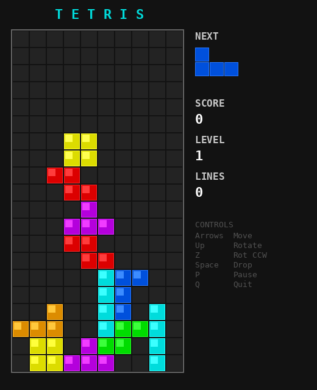
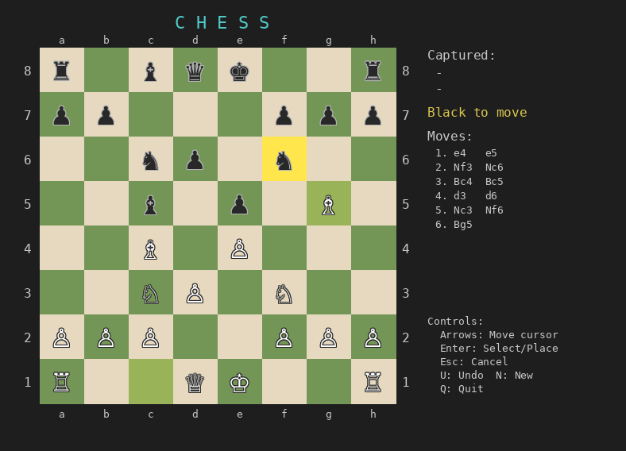
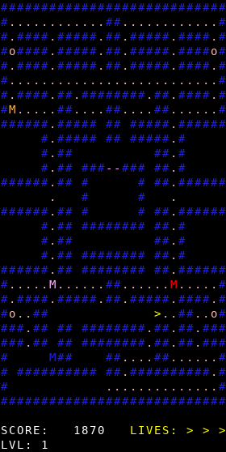
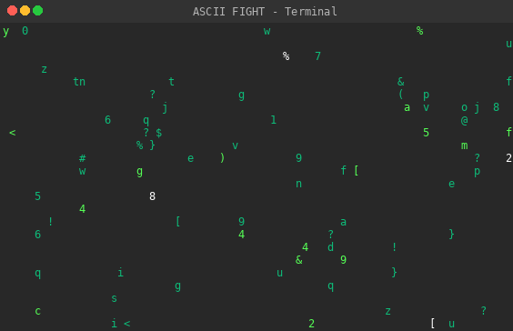
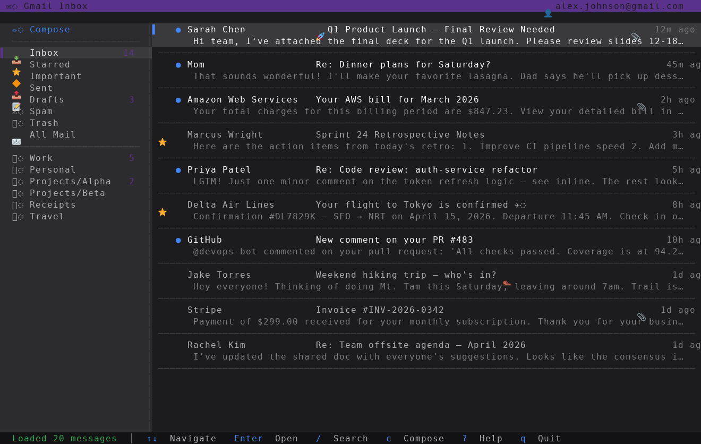
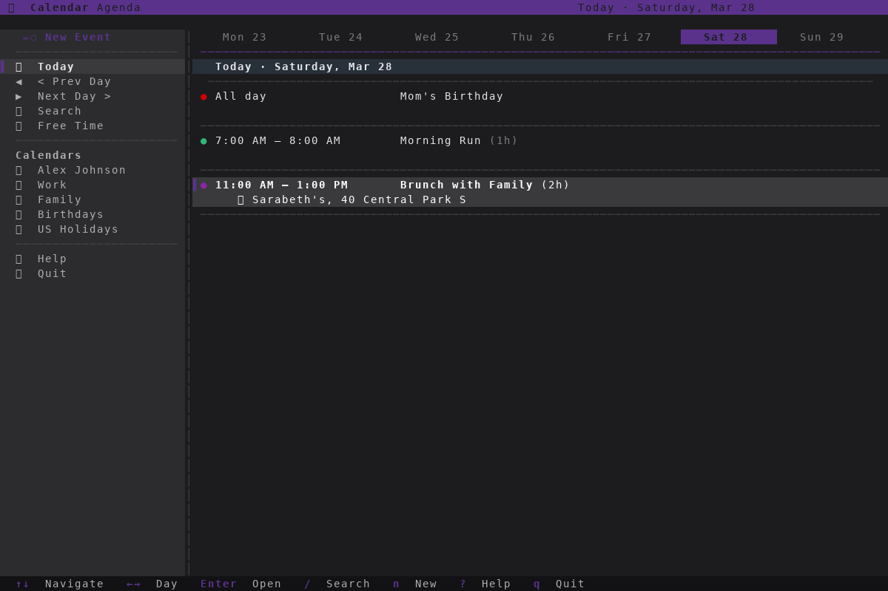
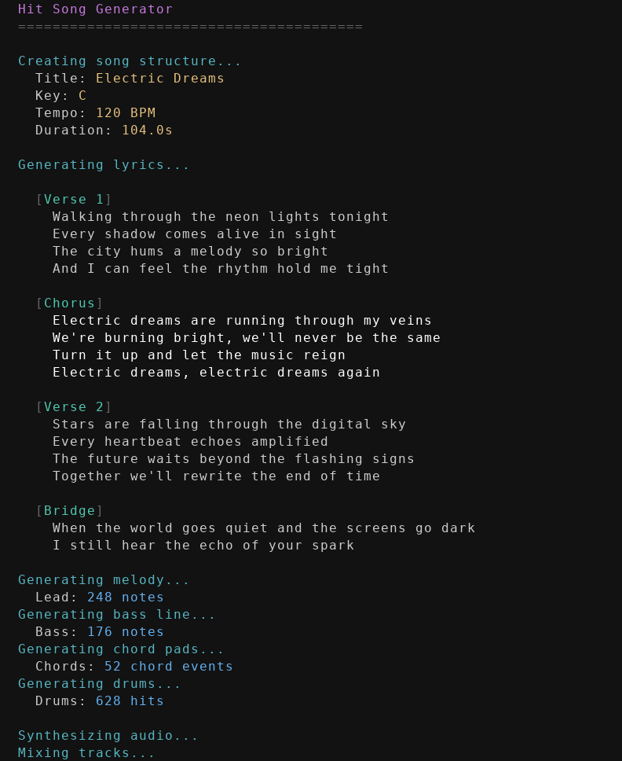
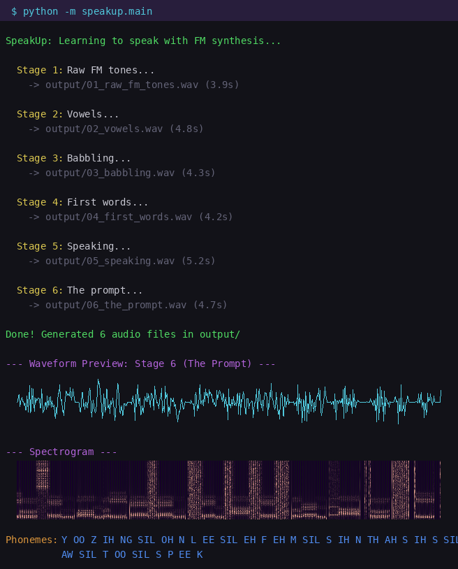

# vibed

A collection of projects built entirely by AI through vibe coding. Each subfolder contains a self-contained application, coded from a simple prompt by Claude Opus 4.6.

## How it works

1. A `PROMPT.md` in each subfolder describes what to build
2. Claude reads the prompt and implements the full application following TDD workflow
3. The AI splits the work into modules, writes failing tests first, then implements until everything passes

## Projects

### [Tetris](tetris/)

> `Make a cool Tetris game for the console.`

Console-based Tetris game using Python curses. Features SRS wall kicks, 7-bag randomizer, ghost piece, scoring, and increasing difficulty.

### [Chess](chess/)

> `Make a nice looking chess game for the console. Do not use a library for generating the moves made by the computer, write your own logic.`

Console-based chess game with a custom AI opponent. Features full chess rules (castling, en passant, promotion), minimax with alpha-beta pruning, Unicode pieces, and colored board squares.

### [Pac-Man](pacman/)

> `pacman`

Console-based Pac-Man game using Python curses. Features a classic maze, 4 ghosts with unique AI personalities (Blinky, Pinky, Inky, Clyde), power pellets, ghost frightened mode, scoring, lives, and level progression.

### [ASCII Art Video](ascii-art-video/)

> `write an application that generates an ascii art video. Content: title page, then 2 stick figures fighting, then something really really funny happens, fade out, finally end-credits. When you're done ask yourself, how can I make it cooler, more amazing, flashier... do that! over and over until you're satisfied.`

Animated ASCII art video playing at 30fps in the terminal. Features a Matrix rain intro, epic stick figure fight with hadouken projectiles, a hilarious banana peel incident that leads to friendship, a sunset fade out, and Star Wars-style credits. Packed with particle effects, screen shake, combo counters, and fireworks.

### [Gmail Client](gmail/)

> `Make a gmail client for the console using the gmail MCP. Make it really user friendly, clean, well designed. Think menus, full rgb, emoji's. Make a few iterations in the design process to get it just right. *Never ever test with the actual mcp*`

Console-based Gmail client powered by the Gmail MCP. Features a dark RGB color theme, emoji-rich sidebar with labels, full inbox/message/thread/compose/search views, draft management, and vim-style keyboard navigation. Includes a complete mock client with 20 realistic emails for safe development — never touches real Gmail.

### [Google Calendar Client](gcalendar/)

> `Do the same as project ../gmail, but for google calendar.`

Console-based Google Calendar client powered by the Google Calendar MCP. Features a dark purple RGB color theme, emoji-rich sidebar with calendar list, single-day agenda view with week navigation, full event detail/create/edit/search/free-time views, RSVP support, and vim-style keyboard navigation. Includes a complete mock client with 25+ realistic events for safe development — never touches real Google Calendar.

### [Hit Song](hitsong/)

> `Write a hitsong and record it to mp3`

Python application that composes and synthesizes a complete synth-pop song ("Electric Dreams") from scratch using numpy waveform synthesis — detuned saw leads, sub bass, warm pads, and synthesized drums — then masters and exports to MP3. No external music libraries needed.

🎵 **[Listen to Electric Dreams (MP3)](hitsong/hitsong.mp3)**

### [SpeakUp](speakup/)

> `Using only FM synthesis, learn how to speak.`

Python application that uses pure FM synthesis to generate human speech from text. Models vocal formants with FM operator pairs, synthesizes vowels, consonants, and coarticulated speech. Demonstrates a progressive "learning to speak" journey across 6 audio files — from raw FM tones to full sentences.

- [01_raw_fm_tones.wav](speakup/output/01_raw_fm_tones.wav) — Pure FM tones and modulation sweeps (3.9s)
- [02_vowels.wav](speakup/output/02_vowels.wav) — Individual vowels: AH, EE, EH, OH, OO, AE, IH, UH (4.8s)
- [03_babbling.wav](speakup/output/03_babbling.wav) — Consonant-vowel babbling (4.3s)
- [04_first_words.wav](speakup/output/04_first_words.wav) — First words: mama, papa, hello, hi, no, yes (4.2s)
- [05_speaking.wav](speakup/output/05_speaking.wav) — Full sentences (5.2s)
- [06_the_prompt.wav](speakup/output/06_the_prompt.wav) — "Using only FM synthesis, learn how to speak" (4.7s)

## Built with

[Claude Code](https://claude.com/claude-code) — Claude Opus 4.6 (`claude-opus-4-6`)
