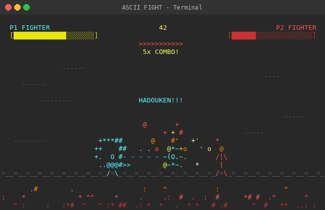

# vibed

A collection of projects built entirely by AI through vibe coding. Each subfolder contains a self-contained application, coded from a simple prompt by Claude Opus 4.6.

## How it works

1. A `PROMPT.md` in each subfolder describes what to build
2. Claude reads the prompt and implements the full application following TDD workflow
3. The AI splits the work into modules, writes failing tests first, then implements until everything passes

## Projects

### [Tetris](tetris/)

> `Make a cool Tetris game for the console.`

Console-based Tetris game using Python curses. Features SRS wall kicks, 7-bag randomizer, ghost piece, scoring, and increasing difficulty.

### [Chess](chess/)

> `Make a nice looking chess game for the console. Do not use a library for generating the moves made by the computer, write your own logic.`

Console-based chess game with a custom AI opponent. Features full chess rules (castling, en passant, promotion), minimax with alpha-beta pruning, Unicode pieces, and colored board squares.

### [Pac-Man](pacman/)

> `pacman`

Console-based Pac-Man game using Python curses. Features a classic maze, 4 ghosts with unique AI personalities (Blinky, Pinky, Inky, Clyde), power pellets, ghost frightened mode, scoring, lives, and level progression.

### [ASCII Art Video](ascii-art-video/)

> `write an application that generates an ascii art video. Content: title page, then 2 stick figures fighting, then something really really funny happens, fade out, finally end-credits. When you're done ask yourself, how can I make it cooler, more amazing, flashier... do that! over and over until you're satisfied.`

Animated ASCII art video playing at 30fps in the terminal. Features a Matrix rain intro, epic stick figure fight with hadouken projectiles, a hilarious banana peel incident that leads to friendship, a sunset fade out, and Star Wars-style credits. Packed with particle effects, screen shake, combo counters, and fireworks.

## Built with

[Claude Code](https://claude.com/claude-code) — Claude Opus 4.6 (`claude-opus-4-6`)
