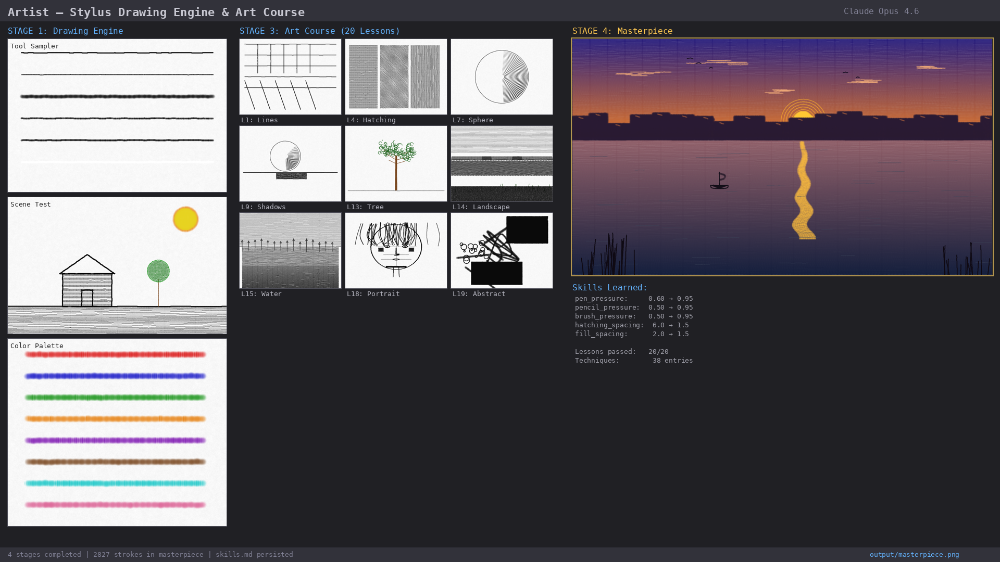

# Artist

```
### Stage 1
1. Define a file format that stores stylus events
   - position=(x,y)
   - direction=(dx,dy)
   - pressure=[0-1]
   - angle=([-45-45],[-45,45])
   - color=[red, black, (r,g,b)]
   - tool=[pen, pencil, brush, etc])
2. Then write an application that can convert such a file to a drawing. The drawing must be a realistic rendering of how drawing with set parameters would like like on plain white smooth paper.
3. Make a couple of drawings, get a feel for it. Imagine what you want to draw, generate the file with stylus events, then look at the results. If they are not as expected, refine either the application or your drawing technique, until you are confident you can accurately reproduce an image you have in your mind. **Aesthetics are everything!**. This tool has the sole purpose of making art, make sure it can render the nuances you will pick up along the way as we improve your drawing skills.

### Stage 2
1. Design a drawing course, 20 lessons, covering everything from the basics of drawing, to portraits, abstract art, landscapes. A course that puts you on the path to become a true artist. This course is about teaching you skills. If you need any source material, check the /home/wipkat/data folder and it's subdirectories (recursively) for images (jpeg and png). There are plenty.
2. For each lesson, define a pass/fail criterion. Make sure that it is attainable given the skills covered in the lesson and those preceding it, but also be critical. Each lesson should bring the student closer to becoming an artist. Make the lessons target a specific area of expertise.

### Stage 3
1. You are now the student. Use the application you made in stage 1 and take the course you created in stage 2 and become a true artist.
2. Don't be hasty, refine, refine, refine.
3. After each lesson, make sure you pass the criterion. Be fair but critical. If you fail the criterion, take the lesson again and do better this time.
4. If you fail the criterion 3 times, it is time to rethink the lesson created in stage 2. When the lesson has changed, retake it.
5. Continue this cycle until you have passed all classes

### Stage4
Congratulations. You should now be a great artist. Make me a work of art. Make it a masterpiece.
Save to png.
```



## Overview

A complete AI art education system: a stylus-based drawing engine, a 20-lesson curriculum, a self-teaching loop with persistent skill accumulation, and a final masterpiece.

## Architecture

| Module | Purpose |
|---|---|
| `stylus_format.py` | Data model (StylusEvent, Stroke, Drawing) + JSON serialization |
| `tool_profiles.py` | Per-tool rendering parameters (pen, pencil, brush, charcoal, marker, eraser) |
| `texture.py` | Procedural noise (pencil grain, paper texture, bristle patterns, charcoal) |
| `renderer.py` | Core stamp-based compositing engine with interpolation |
| `assessor.py` | Computational image analysis for pass/fail grading |
| `course.py` | 20-lesson curriculum with criteria |
| `student.py` | Stroke generation ("drawing brain") that reads skills.md |
| `skills.py` | Persistent skill system -- reads/writes `skills.md` |
| `main.py` | Stage 1-4 orchestrator |

## The 4 Stages

### Stage 1: Drawing Engine
Built a stamp-based rendering engine supporting 6 tools (pen, pencil, brush, charcoal, marker, eraser), each with distinct visual characteristics -- pressure curves, texture overlays, edge softness. Verified with test drawings: line sampler, pressure test, color palette, shapes, and a scene.

### Stage 2: Art Course
Designed 20 lessons across 5 blocks:
- **Foundation (1-5):** Lines, curves, pressure, hatching, crosshatching
- **Form (6-9):** Shapes, sphere shading, cube shading, light & shadow
- **Composition (10-12):** Still life, perspective
- **Nature (13-15):** Trees, landscapes, water reflections
- **Portrait & Advanced (16-20):** Face proportions, features, portraits, abstract, color

### Stage 3: Learning Loop
The student takes each lesson, renders the drawing, and is assessed computationally. After each attempt (pass or fail), it analyzes the assessment results and **updates `skills.md`** -- adjusting tool pressures, spacing, events-per-stroke. These accumulated skills carry forward to all subsequent lessons. If a lesson is failed 3 times, it redesigns the lesson with relaxed criteria. All 20 lessons passed.

### Stage 4: Masterpiece
A sunset landscape over water combining all learned skills -- sky gradients, mountain silhouettes, sun with glow, water reflections, a sailboat, birds, and foreground reeds. 1920x1080, 2827 strokes.

## How to Run

```bash
cd artist
python main.py
```

Outputs are saved to `output/`:
- `output/stage1/` -- Engine test images
- `output/stage2/curriculum.json` -- Course definition
- `output/stage3/` -- All lesson attempts + `results.json`
- `output/skills.md` -- Accumulated drawing skills
- `output/masterpiece.png` -- Final artwork

## Testing

```bash
python -m pytest tests/ -v
```

115 tests across all modules.

## Credits

Built by Claude Opus 4.6 (`claude-opus-4-6`).
