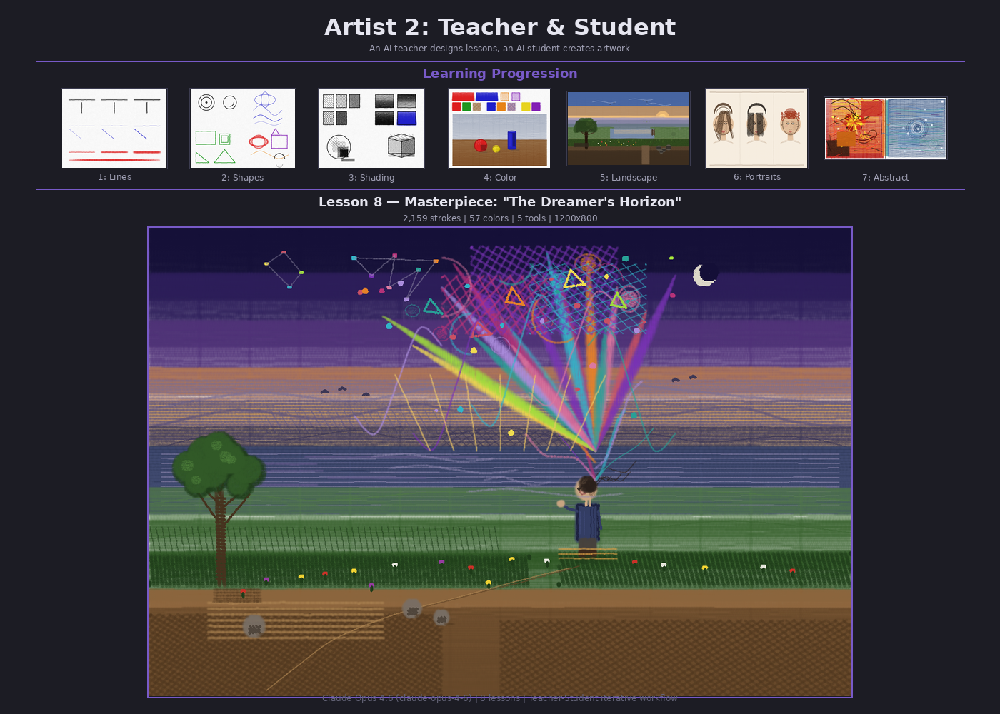

# Artist 2: Teacher & Student

```
Read both TEACHER.md and STUDENT.md. Both define a workflow for 2 agents, each having their own context.
Prepare the directory structure needed for the task, then start the 2 agents.
Check in once in a while, informing me on the progress
```

## Overview

A multi-agent art education system where one AI agent acts as a visual arts **teacher** and another as a **student**. The teacher designs lessons with clear PASS/FAIL criteria, evaluates the student's work critically, and adapts the curriculum based on progress. The student completes assignments using the drawing toolkit from the `../artist` project, creating actual PNG artwork and updating a skills file after each lesson.

## How It Works

Two agents communicate through shared files in an iterative loop:

1. **Teacher** reads `SKILLS.md`, designs a lesson with objectives and PASS/FAIL criteria, writes it to `lessons/`
2. **Student** reads the lesson, writes a Python script using the drawing API, produces a PNG, updates `SKILLS.md`
3. **Teacher** views the output image, evaluates against criteria, updates `ASSESSMENT.md`, designs the next lesson with feedback
4. Repeat until the teacher has nothing more to teach

## Curriculum (8 Lessons)

| Lesson | Topic | Strokes | Key Skills |
|--------|-------|---------|------------|
| 1 | Line Control & Tool Exploration | 16 | pen, pencil, brush, pressure levels |
| 2 | Curves & Shapes | 23 | circles, arcs, ellipses, S-curves, rectangles, triangles |
| 3 | Shading, Hatching & Value | 443 | hatching, crosshatching, gradient fills, 3D form |
| 4 | Color Theory & Composition | 971 | warm/cool colors, complementary pairs, still life |
| 5 | Landscape & Atmospheric Perspective | 1,647 | depth layering, all 5 tools, creative composition |
| 6 | Portrait & Expression | 1,325 | face proportions, 3 expressions, hair, shading |
| 7 | Abstract & Expressive Art | 1,047 | emotional mark-making, energy vs calm diptych |
| 8 | Masterpiece: "The Dreamer's Horizon" | 2,159 | integrated composition, 57 colors, all techniques |

## Directory Structure

```
artist2/
├── TEACHER.md          # Teacher agent workflow
├── STUDENT.md          # Student agent workflow
├── SKILLS.md           # Student's evolving skill record
├── ASSESSMENT.md       # Teacher's evaluations (all 8 lessons)
├── lessons/            # Lesson files (lesson_01.md - lesson_08.md)
├── output/             # Student's scripts and PNG artwork
├── drafts/             # Working space for in-progress work
├── screenshot.py       # Generates the screenshot below
└── screenshot.png      # Composite showing learning progression
```

## The Masterpiece

**"The Dreamer's Horizon"** — A solitary figure stands on a warm foreground hill at twilight, gazing toward distant atmospheric mountains across a still lake. From their head, abstract swirls of color and energy rise and dissolve into the indigo sky — imagination made visible.

- 2,159 strokes, 57 unique colors, all 5 tools
- Integrates landscape, portraiture, and abstract expression into one unified composition



## Built with

Claude Opus 4.6 (`claude-opus-4-6`) — implementation by Claude
