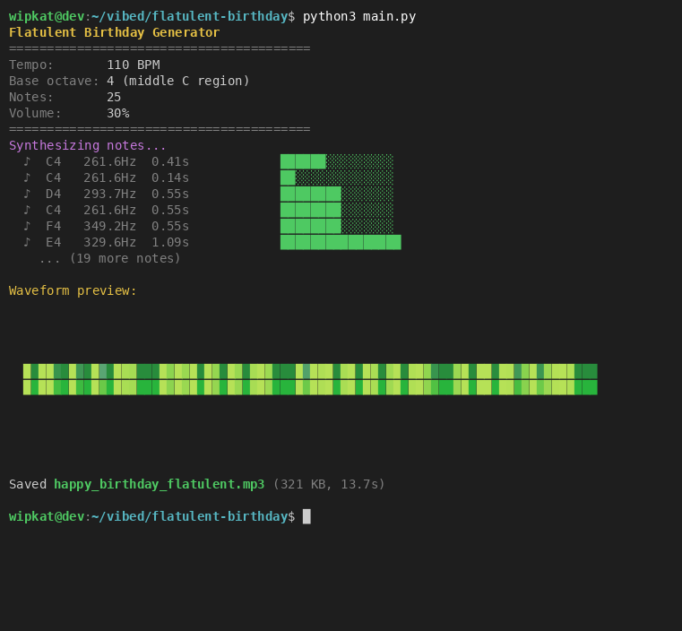

# Flatulent Birthday

```
Make an application that, given a base frequency and duration, synthesizes the sound of flatulence with those approximate parameters.
Make sure synthesis is based solely on scientific, anatomic and acoustic principles, and as the sounds are random in nature, no 2 should ever be the same.
Do at least 3 refinements of the algorithm, making sure the sound is indistinguishable from the original.
Then use it to sing happy birthday and save to mp3. Not too loud please.
```



## How It Works

The synthesis engine models the acoustics of flatulence from first principles:

1. **Sphincter oscillation** — Asymmetric waveform (sawtooth/sine mix) with harmonics and subharmonics from nonlinear tissue dynamics
2. **Turbulent airflow** — Band-passed noise centered around the fundamental frequency, simulating turbulence through the aperture
3. **Body cavity resonance** — Formant-like resonances from the gluteal cleft acting as a quarter-wave acoustic waveguide (~10-15cm)
4. **Amplitude envelope** — Realistic attack/sustain/release with sputtering from irregular muscle tension and micro-stutters

### Refinement History

- **V1**: Basic oscillator + filtered noise with amplitude envelope
- **V2**: Added subharmonics (period-doubling), sphincter flutter, body cavity resonance
- **V3**: Micro-stutters, frequency drift (pressure decay), soft-clipping saturation, formant-like tissue compliance resonances

Every sound is unique due to randomized parameters across all components.

## Modules

- `synth.py` — Core flatulence synthesis engine
- `melody.py` — Happy Birthday note sequence definition
- `renderer.py` — Combines synth + melody, exports to MP3
- `main.py` — Entry point

## Usage

```bash
python3 main.py
```

Outputs `happy_birthday_flatulent.mp3` (192 kbps, ~14s, 30% volume).

## Tests

```bash
python3 -m unittest discover -v
```

26 tests covering synthesis, melody, and rendering.

## Implementation

Built by **Claude Opus 4.6** (`claude-opus-4-6`).
